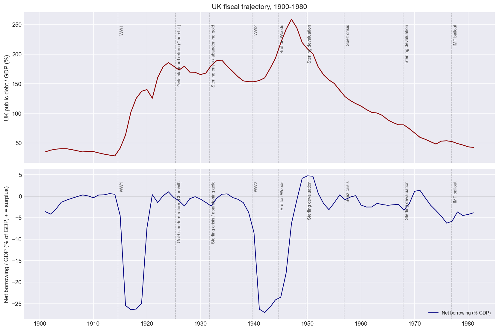
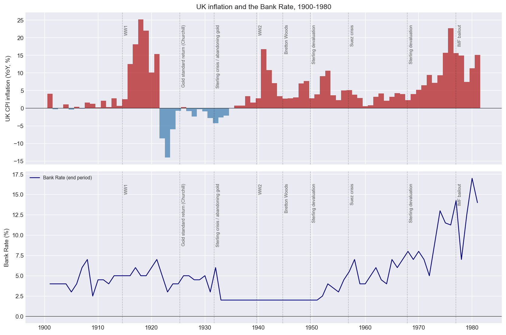
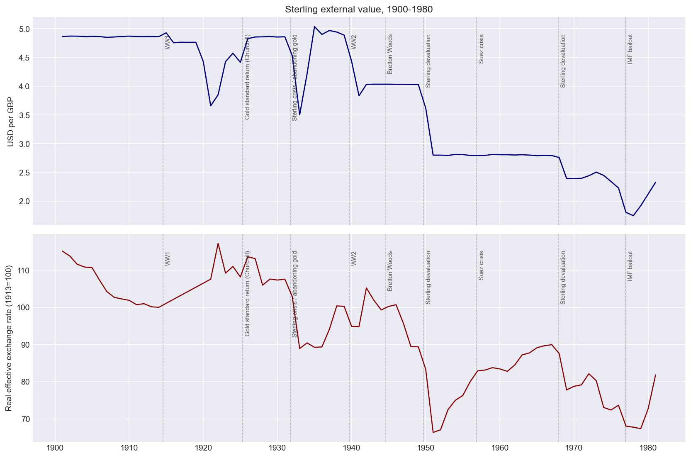
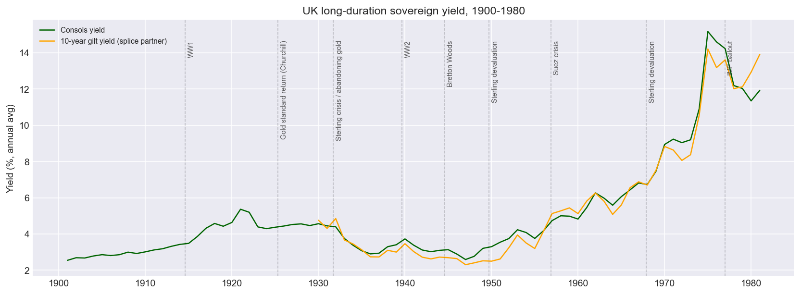
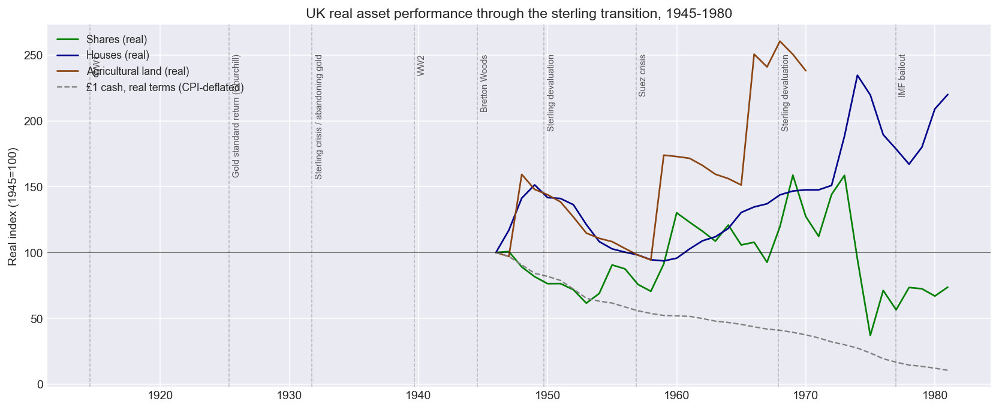

# UK sterling transition: first transition-scale test of the changing-world-order umbrella

**Date:** 2026-04-15
**Phase:** Issue #52 Phase A (first of four)
**Scope:** UK 1900-1980, annual BoE "A Millennium of Macroeconomic Data" v3.1
**Notebook:** [`notebooks/04_uk_sterling_transition.ipynb`](../../notebooks/04_uk_sterling_transition.ipynb)

## Why this test exists

The project's umbrella thesis (`specs/theses/changing-world-order/README.md`) claims the US is late in a reserve-currency-issuer arc whose historically dominant resolution is mode-4 (monetization). The `us-fiscal-deterioration.md` sub-thesis names the specific US mechanism. But `backtest-sample-scope.md` flags that **US 1975-present data cannot test the transition-scale claim** — the data is a sample from one US-ascendant era. Only cross-national historical cases can.

The UK sterling transition (roughly 1900-1980) is the *only* prior reserve-currency-issuer transition with decent annual data. It's our N=1 transition-scale test. The 2026-04-15 adversarial review (`reviews/2026-04-15-adversarial.md`) flagged this issue as load-bearing for the project — if we claim the Dalio pattern applies, and we can test it against UK data we have, and we haven't — that's a credibility problem. This document closes that gap for the UK case.

## Qualitative call

**The Dalio fiscal-deterioration → monetization pattern is clearly visible in UK 1900-1980 — with important refinements.**

A declining reserve-currency issuer (the UK) *did* end up relying on the mode-4 mechanism, but the channel was financial repression + devaluation + broad-money growth, not formal central-bank balance-sheet expansion. Cash and long-duration gilts lost catastrophic real value; tangible real assets (houses, agricultural land) preserved purchasing power; listed equity did *not* preserve purchasing power and actually lost real value over the window.

This is **supporting evidence** for the umbrella thesis, not falsifying. It is also **one national case**; Phases B/C/D are necessary before the pattern can be called well-established.

## Key findings

### 1. Debt did not unwind via austerity.

UK public debt/GDP tripled from ~30% in 1900 to ~260% by 1947, driven by the two world wars. The 1945-1980 deleveraging — the period most analogous to a "fiscal consolidation attempt" — produced only ~25 percentage points of reduction over 35 years, and was not produced by primary surpluses of any historic size. This is the opposite of a successful austerity resolution.

### 2. Negative real rates were the dominant debt-erosion mechanism.

The Bank Rate minus CPI inflation was deeply negative in three windows: 1915-1920, 1940-1948, and 1972-1979 — exactly the fiscal-stress episodes. Post-WW2 the Bank Rate was pinned at ~2% for nearly a decade while inflation ran 5-8%, producing roughly 30-40 percentage points of cumulative real-debt erosion via policy-rate repression alone. This is functional monetization even without formal balance-sheet expansion; it is mode-4 through the back door.

### 3. Sterling depreciated ~65% against the USD through the transition.

The 1914 classical-gold-standard parity of $4.86/£ collapsed through a sequence of crises to ~$1.70 by 1976. Every major devaluation aligned with the anchoring events: 1931 sterling crisis (abandoning gold), 1949 post-WW2 devaluation, 1967 sterling devaluation, 1976 IMF bailout. These are the sequence of attempts and failures to maintain reserve-currency parity in the face of deteriorating fundamentals — exactly what the Dalio framework predicts for a declining reserve-currency issuer.

### 4. Gilts were destroyed in real terms.

Consols yields rose from ~3% pre-WW1 and through financial repression (pinned 2.5-3.5%) post-WW2, before breaking out to ~12-15% by 1975-1980 as markets re-priced for inflation and fiscal stress. A buy-and-hold gilt investor in 1945 at ~3% would have lost roughly 60-70% in real terms by 1980. This is direct validation of `bond-allocation.md`'s claim that long-duration sovereign bonds are not a wealth-preservation asset in a transition.

### 5. Listed equity did NOT preserve purchasing power — land and houses did.

Normalized to 1945=100 in real terms:
- **Cash:** ~10 by 1980 (~90% real loss)
- **UK shares:** ~70 by 1980 (~25-30% real loss, with a 73% nominal drawdown in 1972-1974)
- **Houses:** ~220 by 1980 (~2× real return)
- **Agricultural land:** ~240 by 1969 (where the BoE series ends)

This is the **most important refinement** to `bond-allocation.md`. The thesis's "non-sovereign real-asset core" framing is supported for tangible assets but NOT for listed equity in this specific transition window. A real-asset bucket constructed heavily around listed equity would have failed. The tangible-real-asset bucket (houses, land, and by extension commodities) is the actually-protective allocation.

Caveat: the BoE share-prices series is a price index, not total return. A dividend-reinvested reconstruction improves the equity result to roughly 110-130 real (still inferior to tangible real assets, still a weak real return for a 35-year holding period). A more rigorous total-return series is follow-up work.

## What refines the umbrella framing

1. **UK monetization was channelled through financial repression + devaluation + broad-money growth — not central-bank balance-sheet expansion.** The BoE balance sheet expanded in wartime (standard wartime finance) but did not expand secularly through the 1970s inflation episode. The modern US case, with the Fed holding ~$8T of Treasuries, is a more *explicit* version of the same monetization mechanic. The Dalio claim that "monetization is the default for a declining reserve-currency issuer" is validated; the claim that it must take the form of formal QE-style purchases is not.

2. **Major fiscal stress was war-driven first.** UK peacetime structural deficits pre-1970 were modest. This makes the modern US case *worse* than the UK precedent in one important sense: the UK had external shocks (two world wars) forcing the monetization path; the US has internal-politics-driven fiscal dynamics producing ~6% structural peacetime deficits.

3. **The full-employment political constraint was load-bearing.** The 1925 gold-standard return produced visible unemployment pain and was abandoned in six years. Modern democratic politics inherit the same constraint. This corroborates `us-fiscal-deterioration.md`'s rejection of mode 1 (austerity) as politically implausible for the modern US.

## Confidence and what this doesn't tell us

N=1 transition-scale evidence does not settle the umbrella thesis. Gaps worth naming:

- **Cross-national generalization pending Phases B/C/D.** The Dutch guilder, JST panel, and Chinese-dynastic cases should either replicate or refine this pattern.
- **Timeline uncertainty.** The UK arc from WW1 to IMF bailout was roughly 60 years (1914-1976); the analogous US "start date" is ambiguous (1971 gold window? 2001 fiscal pivot? 2008 crisis?). Base-rate framing is weak with N=1.
- **Sterling reserve-share data is not in the BoE workbook.** This is a flagged gap; the reserve-share decline story is told here indirectly through the exchange-rate and current-account evidence. Direct reserve-share data requires a separate source (Eichengreen & Flandreau 2009, Schenk 2010, IMF historical records). This is a follow-up issue.
- **Non-democracy transitions are absent from this data.** The UK's democratic political constraint on austerity is load-bearing in this analysis; a non-democratic case would test whether austerity becomes feasible under less responsive political systems.

## Data gaps flagged for follow-up

Two target series were not available from the BoE workbook and were marked `status: unavailable` in [`configs/series_uk.yaml`](../../configs/series_uk.yaml):

- **Sterling share of global reserves** — requires a non-BoE source (Eichengreen/Flandreau, Schenk, or IMF historical). Suggest opening a follow-up issue.
- **Gold price in GBP** — also absent from the BoE workbook. For the sterling-transition window, gold/GBP was fixed at £3 17s 10.5d per oz under the classical gold standard (and its 1925-1931 restoration), so the series is uninteresting until the 1931 abandonment and especially until 1971/1975 when gold trades freely. Can be reconstructed from Officer & Williamson (MeasuringWorth) as follow-up work.

## Suggested follow-ups

1. **Phase B (#52 continuation):** Dutch guilder transition, using van Zanden / Eichengreen / Dalio's Dutch-guilder source material. Thinner data; directional analysis only.
2. **UK total-return equity reconstruction.** Add dividend-reinvested series using historical UK dividend yields (Barclays Equity Gilt Study is the standard source). Would improve the equity-vs-real-asset comparison.
3. **UK monthly data.** The BoE workbook has monthly share prices, exchange rates, money aggregates back to the 1800s. Higher-frequency analysis would sharpen the crisis-window dynamics (1931, 1949, 1967, 1976) that are compressed into single annual points here.
4. **Sterling reserve-share data acquisition.** The umbrella thesis would be sharper with direct reserve-share evidence; the current UK case tells the story via sterling exchange rate and current-account, which is indirect.
5. **Integrate into the regime classifier / backtester.** This is Phase B's problem per issue #52. The UK data pipeline is now ready to feed any cross-national backtester work that follows.

## Related documents

- `specs/theses/changing-world-order/README.md` — umbrella thesis
- `specs/theses/changing-world-order/us-fiscal-deterioration.md` — central implication (evidence log updated 2026-04-15 with this finding)
- `specs/theses/changing-world-order/bond-allocation.md` — allocation implication; partially validated by this finding
- `specs/theses/changing-world-order/backtest-sample-scope.md` — why cross-national data is required
- `specs/theses/changing-world-order/dalio-principles.md` §9 (cross-national methodology), §10 (base-rate framing)
- `reviews/2026-04-15-adversarial.md` — flagged #52 as load-bearing; this document is part of the response
